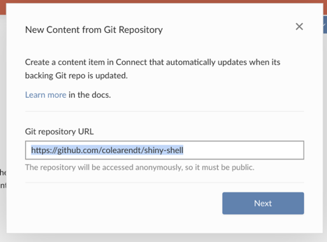
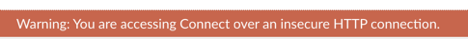

# Getting Started

Welcome!! And thanks for joining our little workshop :smile: I hope it is
useful for you!

Please ask questions and participate as we go!!

The aim today will be:
- “Level up” our docker familiarity
- See the different authentication mechanisms in action
- Get several of them running on your local computer for “hands on” work
- Establish a foundation for future learning / exploration (i.e. you can tweak
  the configuration and see what happens!)

_Disclaimer_: running our products in docker changes a little bit about how we
think about the product, restarting the product, etc. While this is a bit of a
learning curve, I personally have found it not to be a detriment but to give me
a better sense for how docker works and how our products work.

If you get stuck on docker, please raise your hand and let me know! The goal is
to find a path to making this workshop useful for you, and we definitely do not
want to allow frustration to build at all!

## Survey Results

Most interesting auth mechanism: SAML! (Then LDAP and Kerberos)

Most intimidating auth mechanism: Kerberos (by a mile), then SAML and LDAP

# Exercise 0 - Let's Start Connect

## Getting Started

To show us that we have things working, and as a simple baseline. Let’s start a
Connect instance locally!!

- Make sure you have cloned the git repository locally:
  https://github.com/rstudio/sol-eng-docker

```
# for https using a GITHUB_PAT
git clone https://github.com/rstudio/sol-eng-docker.git

# for ssh using a ssh key
git clone git@github.com:rstudio/sol-eng-docker.git
```

Open a terminal (I recommend iTerm2) and cd to the directory where you cloned
it. 

```
cd sol-eng-docker
```

Make sure the repository is up to date

```
git pull
```

Start Connect!

```
make test-env-up
export RSC_LICENSE=mylicensekey
env | grep LICENSE
make connect-up
```

This should give you output like the following:
```
make connect-up
NETWORK=sol-eng-docker_default \
        RSC_LICENSE=MY-LICENSE-KEY \
        CONNECT_VERSION=1.8.2.1-12 \
        docker-compose -f compose/base-connect.yml -f compose/make-network.yml up -d && \
        ./bin/pdocker ps compose_connect
Creating compose_connect_1 ... done

compose_connect_1:      3939    ->      http://localhost:32821
```

One of the benefits of iTerm2 is that you can click on this link directly in
your terminal to open http://localhost:32821 (in my case) in your browser! You
should see Connect running!!

## Troubleshooting
- There is nothing available in the browser…?
    - Try running `docker logs compose_connect_1`. What happened to the Connect
      server?
- It looks like my license didn’t work?
    - Make sure that the RSC_LICENSE environment variable is exported in your
      environment by running `env`.
    - Make sure that your license has enough activations (you can reset them
      here: http://apps.rstudio.com/deactivate-license/ )

## It's Alive!!!

- You should see Connect running in your browser
- Click “Sign Up” and create a user. This should log you into this fresh
  connect server
- To prove this is a functional Connect server, let’s do a git-based deployment
  of the https://github.com/colearendt/shiny-shell app (master branch)



- See! It's alive!! Well done!!

## One last thing

- Let’s prove that we have complete power over this Connect instance :smile:

- We are going to remove this error message from our browser:



- In your terminal (or your favorite file editor), open the file
  `./cluster/base-connect.gcfg`
- Inside of this file, add the following line to the [Http] configuration
  section:

```
NoWarning = true
```

- Now we need to restart Connect, which means “restart the docker container.”
  So run the following:

```
make connect-restart
```
- You should get a new port in your terminal. If you open it in your browser,
  the warning message should be gone! Well done!! You have the power!!

## Closing Notes

- You now have “uncommitted” state in this git repository (because you edited a
  file). This is fine while you are working. When you’re done, you will want to
  run

```
git checkout -- cluster/base-connect.gcfg
```

- We will leave this running for now. However, the way to stop & remove it from
  your system is to:

```
make connect-down
```

- Not all “make targets” will have a “make \*-restart” endpoint. To do this
  yourself, you will need to:

```
docker restart compose_connect_1
docker ps | grep compose_connect_1
```

- For simplicity, we have a little python wrapper that makes this easier (feel
  free to add this to your PATH for easier reference). NOTE that this can cause
  problems and using `docker` is generally preferred. Please report issues!!

```
./bin/pdocker restart compose_connect_1
```

