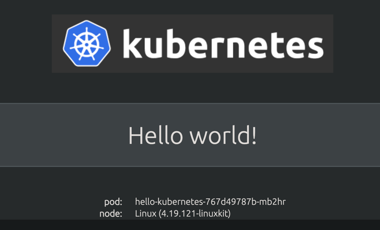

# Kubernetes

This module will walk you through some basics for getting started with
Kubernetes, so we can use it for further product exploration / playing.

## Overview

- [docker and containers](./get_started.md)
- [Set up a lightweight dev environment](./k8s/k3d.md)
- [Kubernetes and YAML](./k8s.md#what-is-kubernetes)
- [Helm](./k8s/helm.md)
- [Using Helmfile](./k8s/helmfile.md)

## What is Kubernetes?

> One simple way of thinking about Kubernetes is YAML that defines deployments of docker (or other) containers

Kubernetes is a specification that simplifies deployment of containers across multiple hosts in particular, and
microservice architectures, in general. At its most basic, deployments to Kubernetes consist of YAML (or JSON). The
specification differs from `docker` and `docker-compose`, but the paradigm is similar.

## Getting started with Kubernetes!

First, let's do some environment setup:

- [Install `kubectl`](https://kubernetes.io/docs/tasks/tools/)
  - on Mac, TL;DR; (if using `brew`): `brew install kubectl`
- (Optional) [Install other related tools](./k8s/install.md)
- [Setup appropriate access](./k8s/setup.md) to a Kubernetes cluster

Now let's have some fun!

## A simple example

> One simple way of thinking about Kubernetes is YAML that defines deployments of docker (or other) containers

Let's create a simple deployment. This is an
adapted [hello-world example](https://github.com/paulbouwer/hello-kubernetes)

```bash
# go to the simple kubernetes resource folder
cd k8s/simple
kubectl apply -f hello-world.yaml
```

Now we want to make sure it is working!

```bash
kubectl get pods
kubectl get svc
kubectl get service
kubectl logs <name_of_pod>
```

If the pod is alive, let's take a look!

```bash
# change local port with something like 8090:8080
kubectl port-forward svc/hello-kubernetes 8080:8080
```

Now go to [http://localhost:8080](http://localhost:8080) in your browser!

You should see something like:



When you are done, you can remove it from your cluster like so:

```bash
kubectl delete -f hello-world.yaml
```

### How did that work?

- `kubectl apply` is like `docker-compose up` or `docker run`
- Instead of running "locally", the deployment goes to a Kubernetes cluster
- In order to see the service locally, you need to do one of two things:
  - "Expose" it publicly via a LoadBalancer or Ingress
  - "port-forward" to your local machine. You can think of this like an SSH tunnel
  
### A few notes

Take a look at [hello-world.yaml](../k8s/simple/hello-world.yaml)

- Notice Service "type" `NodePort`. This gives the service a dedicated port
  - You _can_ specify which port, but that is usually overkill and a pain to maintain
- Service "type" `LoadBalancer` will define a load balancer automatically for the service
  - i.e. on EKS, you can automatically provision an ALB
  - This works nicely on [`k3s`](./k8s/k3s.md), but is often overkill (ALB per service? No thanks)
  - Instead, we will show you how defining an "Ingress" service gives you more control!
- It is a best practice to define service ports that are "standard" for the protocol
  - I.e. 80 instead of 3939, etc.
  - Containers listen on ports that are standard for the service (i.e. 3939 for Connect)
  - The service can map to a standardized port so generic Kubernetes routing can be agnostic to specific app
    configuration

## Interactive Shell

Let's try another simple example to see more about how you can debug containers.

In the same `k8s/simple` directory, run:
```bash
kubectl apply -f busybox.yaml
```

This container writes its hostname and time periodically to /tmp/index.html

To see this in action, let's shell into the container

```bash
kubectl exec -it <name_of_pod> -- sh
```

And cat the file:
```bash
cat /tmp/index.html
```

Over time you will see that it continually updates this file every 10 seconds or so.

To remove:

```bash
kubectl delete -f busybox.yaml
```

### More Notes

Take a look [busybox.yaml](../k8s/simple/busybox.yaml)

- In docker, you have the following types of configuration:
  - `ENTRYPOINT`: The "base command" always executed by the container
  - `COMMAND`/`CMD`: The "arguments" passed to the entrypoint executable / script
  
- In Kubernetes, this paradigm changes to a better-named convention:
  - `command`: Analogous to `ENTRYPOINT`. The "command" always executed by the contanier
  - `args`: Analogous to `COMMAND`. The "args" passed to the "command"
