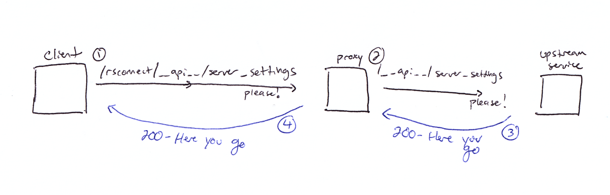
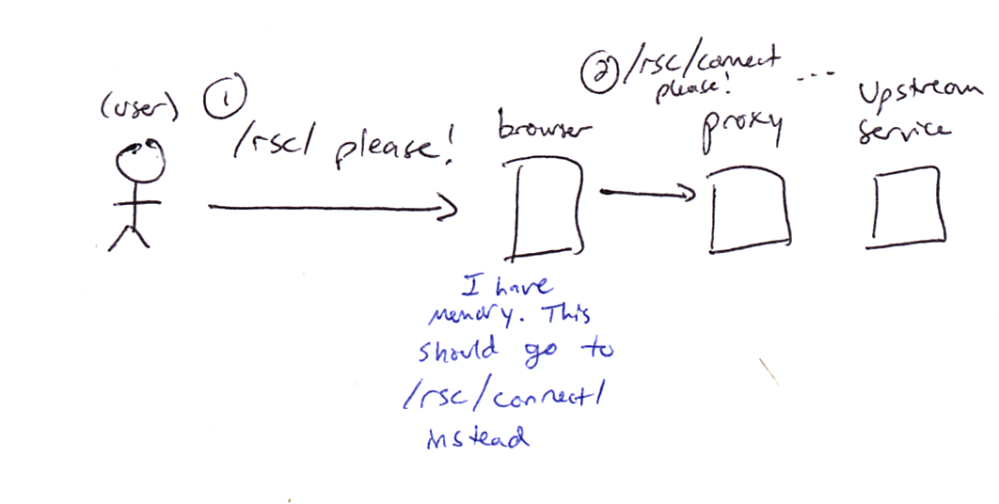

# Proxies

Debugging proxies can be tricky. I also have found that "reading proxy
configuration" is _very hard_ in that it is difficult to predict what a proxy
will do without a bunch of practical experience.

The best way to amass this understanding (in my experience) has been trial and
error. As a result, there are two important pieces:

- The ability to craft and monitor requests and traffic from the client side
- The ability to tweak, try, and test configuration on the server side

We will address both of these approaches below. However, first we have to
_have_ a server!

## What is a reverse proxy?

A _reverse proxy_ handles inbound traffic and directs it upstream into your
network. A _forward proxy_, by contrast, handles outbound traffic and is
typically used for security.

Although there are some resources in this repository to play with "forward
proxies," and several customers use them in offline or semi-offline
environments, we will focus on "reverse proxies" here.

The two most common reverse proxies in use by our customers today are:

- Apache / `httpd`
- `nginx`

There a whole host of others, both paid and open source:

- F5
- Application Load Balancer (AWS)
- Other cloud provider options
- Envoy (used in Kubernetes)
- Traefik (used in Kubernetes)

# Exercise 0 - Create a Reverse Proxy

For the purposes of our example, we are going to use `nginx`. I am biased
and much prefer `nginx` to `apache`/`httpd` :smile:

Run the following to start a generic `nginx` proxy for all of our products:

```
make proxy-nginx-connect-up
```

Now go to the URL shown... does it work? Why or why not?

```
docker logs compose_proxy-nginx-connect_1
```

`nginx` checks that the "upstream" hosts exist and are
routable when it starts up! We haven't started Connect yet.

Let's start a Connect instance to proxy!

```
make connect-up
```

Now start your proxy. It should definitely work this time!

```
make proxy-nginx-connect-up
```

If your proxy is listening at http://localhost:32128 , navigate to the path
`/rsconnect/`.  For my example URL, this would look like

```
http://localhost:32128/rsconnect/
```

You should see Connect's user interface! Well done!

# Exercise 1 - Understanding Traffic Patterns

## Overview

In therapy, many issues are resolved by debugging communication problems. To do
so, therapists typcially have a paradigm they are working within and a set of
tools that help them diagnose and improve communication issues.

Debugging proxies (or any networking problem, really) is very similar to this!
After all, computers are talking to each other and they are not understanding
one another. The nice thing is that computers and proxies are deterministic,
which cannot be said for us humans. So we have it easier than the therapists.

This is the paradigm we will be working within. There are a few common
communication patterns we should keep an eye out for.

### 200 - Requesting Content Directly

This is a simple pattern of communication. "Give me the thing"

- Client requests `/rsconnect/__api__/server_settings`
- Reverse proxy forwards request for `/__api__/server_settings`
- Backend server gives the response
- Reverse proxy tells the client the response



### 301 - Redirect

I call this ["these are not the droids you are looking
for"](https://www.youtube.com/watch?v=532j-186xEQ&t=44s).

Common status codes are 301/302/307/30x/etc., and the "Location" response header is very important.

- Client requests `/rspm/`
- Reverse proxy forwards request for `/` to backend server
- Backend server says "these are not the droids you are looking for." You should request `/client/`
- Reverse proxy tells client to request `/rspm/client/` instead


### 404 - Not Found

"I don't know what you're talking about". This happens when the proxy or
upstream server has no idea what you are requesting

- Client requests `/rsc/party_time`
- Reverse proxy forwards request for `/party_time` to backend server
- Backend server says "I have no idea what you're talking about"
- Reverse proxy forwards the response back to the client


### 502 - Upstream not responding

Typically reverse proxies have a timeout. If the upstream server does not
respond after a certain period of time, the proxy will terminate the connection
and tell the client "I don't know what's wrong"

- Client requests `/rsc/`
- Reverse proxy forwards request to `/`
- Backend server does not respond... proxy waits
- After the timeout, proxy stops waiting and responds to the client


### Caching

Just like humans and water (shoutout "Frozen 2"), browsers and proxies have
memory. This can work out _amazing_ for performance and enables much of the web
as we know it. However, it can also be your worst nightmare if the cache
remembers something bad.

As they say, there are only 2 hard things in computer science. Naming, cache
invalidation, and off-by-one errors. You will find both in this repository :wink:

- Client requests `/rsc/`
- Browser remembers that this path redirected to `/rsc/connect/` last time (with a "permanent redirect")
- Browser requests `/rsc/connect/` instead



## Let's try it!

- Open up your "browser devtools" and navigate to the URL for your proxy.

   - What do you get? 404! Not found! Because this proxy does not serve anything at "root"

- Now navigate to `/rsconnect/`

    - What happens in your traffic? Which patterns do you see?

- Now stop Connect

```
make connect-down
```

    - What happens?

You have now seen some of the most pernicious proxy issues our customers
experience! What's fun is there are millions of ways to create these problems,
and many many ways to resolve. Welcome to proxy therapy, you are now the
therapist.

# Exercise 2 - Break it down!

- Comment out `rewrite`
- Comment out `proxy_redirect`
- Stop Connect
