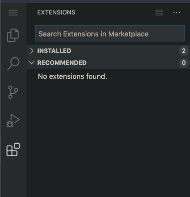
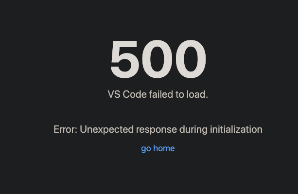

# Visual Studio Code

Visual Studio Code (technically `code-server`, an open-source and server-based project based on VSCode's source) is an
option within RStudio Server Pro / RStudio Workbench. This section will walk through building an example environment,
debugging common issues, and reproducing customer issues.

(Keep in mind that demo environments like https://colorado.rstudio.com/rstudio are also available for use!)

## Using the Demo Environment

We will start out with https://colorado.rstudio.com/rstudio , since this demo environment
has support for VSCode sessions.

### Install an Extension

Start a session, and navigate to the "Extensions" pane



Search for "Python" and install the "Python" extension.

Now start a terminal (Menu -> Terminal -> New Terminal)

And look in the default `extensions` directory:

```bash
ls .local/share/code-server/extensions/
```

Do you see the extension you just installed!? Extensions are installed into the home directory by default

#### Troubleshooting extensions

Extensions can be handled in two "modes":
 - "user install" mode (the default)
   - In this mode, the admin does no extension configuration, and users install their own extensions into their home
     directory
   - This will not work at all in offline environments, and may make security conscious customers wary
 - "admin install" mode
   - In this mode, the administrator installs extensions and configures a "global" directory that all users reference for extensions
   - All users get the same extensions / versions
   - Users usually do not have write access to this directory / will not be allowed to change extensions
   - The admin will set `args=--extensions-dir=/opt/code-server-extensions` (or some such path) in `vscode.conf`

IMPORTANT NOTE: These modes _cannot be "mixed"_ today. This is a global setting, so if you set `--extensions-dir` then
no users will be allowed to install their own extensions.

### Start a bad version of VSCode

It just so happens that it is easy to start a "bad" version of VSCode (incompatible with RStudio Server Pro) by running
a different container image (today).

Start a new session and use the image:
```bash
rstudio/r-session-complete-preview:bionic-preview-1.4.1106-5
```

If you can get to the error message before it disappears...
```
***** Please use the script in bin/code-server instead!
***** This script will soon be removed!
***** See the release notes at https://github.com/cdr/code-server/releases/tag/v3.4.0
[2021-03-25T15:44:22.208Z] error Unknown option --disable-updates
```

Other possible failure modes:
 - more disappearing sessions and other arg problems
 - session starts, but you get a blank / white page

### Another fun error

I believe this will be fixed in the "Juliet Rose" release

When you start your "first" VSCode session, you get a nice "500" error page



Solution is to kill and start a new session, or "go home" and start a "Code Server" session

## Getting Started

Once [you have your environment set up](), here is a simple example environment that works out of the box.

```bash
make rsp-up
```

Now log into the UI at the port returned by this command, using the credentials `rstudio:rstudio`.

You should be able to start VSCode sessions and toy around with the IDE!

Try these ideas:

- Create a new file
- Start a Python terminal
- Start a bash terminal
- Use a bash terminal to install a python package. `pip install pyyaml`

## VSCode Path Issue

One common issue that happens with RStudio Server Pro is a mis-configured `vscode.conf` file that points to `exe`.
This [_must be the same across all sessions_]() (which causes problems particularly in Kubernetes).

So let's reproduce the problem!

Edit `cluster/vscode.conf` and change the code-server path to `/opt/code-server-fail/code-server` (this does not exist in our container)

_cluster/vscode.conf_
```
exe=/opt/code-server-fail/code-server
default-session-cluster=Local
```

Then restart RStudio Server Pro:
```bash
make rsp-restart
```

Now log in and try to start a vscode session again... weird, huh? At the time of
writing, you should get nothing in the UI... no error, no logs, nothing... So what do we do?

Let's go look at the logs:
```bash
docker exec -it compose_base-rsp_1 bash

cat /var/lib/rstudio-launcher/rstudio-launcher.log
```

Yeah... nothing really useful there. Let's look at some other logs...
```bash
# poke around in this directory... (user specific - rstudio is our username)
cat /var/lib/rstudio-launcher/Local/output/rstudio/

# for example:
cat /var/lib/rstudio-launcher/Local/output/rstudio/vOsaUhDSXIpZs9zJV9xlfg\=\=.stderr
```

Ahah! The problem that we expected! Not super intuitive to find, is it? ProdPad that puppy! :)

## What if the Launcher is not Started?

Part of the trick of debugging VSCode sessions is debugging the launcher itself! (since vscode
only works with Launcher). So what happens in the UI if the launcher is having issues...?

Revert our change to `vscode.conf`:
```bash
git checkout -- cluster/vscode.conf
```

Now edit `compose/base-rsp.yaml` and add an `environment` variable to disable launcher:
```yaml
    environment:
      RSP_LICENSES: ${RSP_LICENSE}
      RSP_LAUNCHER: "false"
```

Now restart RStudio Server Pro. Actually, after changing the
definition of `base-rsp.yml`, `rsp-up` gives what you want:
```bash
make rsp-up
```

Now log into the browser again, and what do you see? Launcher sessions are read-only! And _lots_
of these in the logs:

```bash
docker logs compose_base-rsp_1
# ...
08 Feb 2021 18:01:41 [rserver] ERROR system error 111 (Connection refused); OCCURRED AT void rstudio::core::http::TcpIpAsyncConnector::handleConnect(const rstudio_boost::system::error_code&, rstudio_boost::asio::ip::basic_resolver<rstudio_boost::asio::ip::tcp>::iterator) src/cpp/server/ServerSessionProxy.cpp:210; LOGGED FROM: rstudio::server::job_launcher::{anonymous}::ensureServerUserIsLauncherAdmin()::<lambda(rstudio::core::ExponentialBackoffPtr)>::<lambda(const rstudio::core::Error&)> src/cpp/server/ServerJobLauncher.cpp:860

# NOTE: in some cases, this error message is benign and just an intermittent connection issue...
# in our case, it is _definitely_ not benign
```

Also, you will notice that eventually (it doesn't take _that_ long, RSP will die / fall-over). You can `make rsp-up`
again to bring it back.

(Go back and remove the line you added from `compose/base-rsp.yml`)

## Start everything manually

What if you want to try some hackery and you need to start launcher / RSP interactively? We can do that too!

Edit `compose/base-rsp.yml` to change the command
```yaml
    command: ["sleep", "100000"]
```

(For reference, that is a day, and then the container will die. Adjust accordingly if you want RSP to live longer).
Then `make rsp-up`

Now log into the container:
```bash
docker exec -it compose_base-rsp_1 bash
```

And start things manually:
```bash
deactivate() {
    echo "Deactivating license ..."
    rstudio-server license-manager deactivate >/dev/null 2>&1
}
trap deactivate EXIT
/usr/lib/rstudio-server/bin/license-manager activate $RSP_LICENSE

# create a user
useradd -m -s /bin/bash -N -u $RSP_TESTUSER_UID $RSP_TESTUSER
echo "$RSP_TESTUSER:$RSP_TESTUSER_PASSWD" | sudo chpasswd

# background the launcher (could also run in a separate shell)
/usr/lib/rstudio-server/bin/rstudio-launcher > /var/log/rstudio-launcher.log 2>&1 &

# check launcher status
curl localhost:5559/status
# {"metrics":{"runTime":"00:00:24","totalRequests":1,"connectionCount":1},"status":"Green"}

# start RSP (takes your shell)
/usr/lib/rstudio-server/bin/rserver --server-daemonize 0 > /var/log/rstudio-server.log 2>&1
```

Now go log into the UI (the port was given when you first opened the container). You can also retrieve the port with:
```bash
docker ps | grep base-rsp
# or
./bin/pdocker ps base-rsp
```

And `exit` to leave your experiment / deactivate the license

To tear the container down:
```bash
make rsp-down
```

## Start vscode outside of RSP

### TODO

## Separate RSP and Launcher

This is not a common architecture, but it can give us a bit more understanding of how the different services work.

Start the launcher independently of RSP:
```bash
make launcher-up
```

Shell into the launcher container and create your user:
```bash
docker exec -it compose_launcher_1 bash

# create our user again
useradd -m -s /bin/bash -N -u $RSP_TESTUSER_UID $RSP_TESTUSER
echo "$RSP_TESTUSER:$RSP_TESTUSER_PASSWD" | sudo chpasswd

exit
```
> NOTE that we are making sure the UID is the same...
 
Configure RSP to use the launcher service by modifying `cluster/base-rserver.conf`:

_cluster/base-rserver.conf_
```ini
launcher-address=launcher
```

Add this volume to `compose/base-rsp.yml`
```yaml
    # under volumes...
    # volumes: 
      - ../shared/local-launcher/home/:/home
```

And start a fresh RSP:
```bash
make rsp-down rsp-up
```

Now log into the browser and start a session!

Execute this code to see where your session is running...
```
system("hostname")
```

## Final Note

`launcher-sessions-callback-address` has been misconfigured the whole time... in order to properly configure it, we will
need to make the port that RSP listens on consistent (rather than choosing a random / ephemeral port at runtime)
